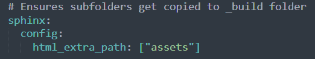
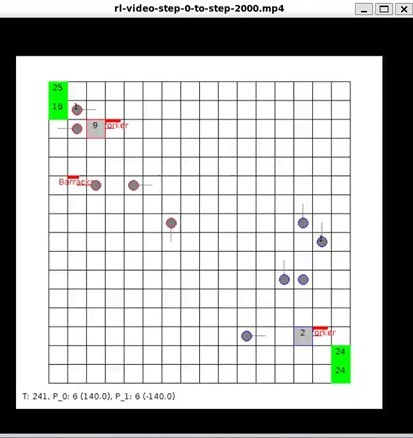

# Clipboard


## Images and Video

Can be tricky and frustrating. Main problem is that when you build a Jupyter Book with `jb build .`, by default Jupyter Book <u>doesn't</u> automatically copy all assets folders to the _build/html directory. This is a known issue that occurs when linking to local assets like images, data, or code files that you want available in the HTML version [GitHub](https://github.com/executablebooks/jupyter-book/issues/790). 

The easiest fix is this:

1.  Put all image and video files in the _static folder in the root directory. Jupyterbook copies these over by default.  So for example

   * root/_static/images/pic1.png

   * root/_static/videos/video1.mp4

2. Drag and drop these into the md page


Alternate way is to create your own folders, put your images and videos there, and modify the config file as follows:



This is effectively the same as putting stuff into the _static folder. The only advantage is that you can create your folder anywhere, not just at the rootdir. 

##### Typora specific

*Check Typora's settings in File>Preferences>Image*

Some editors like Typora provide special options for referencing files, for example,  './folder/file' instead of 'folder/file'


#### Images and Relative Path

<u>Always use relative path.</u> This is especially important when you publish to cloud or transfer to other computers. Try dragging and dropping first and let the markdown editor do the heavy lifting by locating the files and providing the snippet.


<video src="../assets/murts.mp4"></video>




## Continuation in Markdown

This is a long sentence that goes on and on...

::: note
This is a note about...
:::


---
This is a new section.
---


In Jupyter Book, the MyST (Markedly Structured Text) parser supports several specific directives for callouts. The common directives you can use include:

1. **note**: A general note or piece of information.
2. **warning**: A warning about potential issues or important information.
3. **tip**: A helpful tip or suggestion.
4. **important**: An important piece of information that should be highlighted.
5. **caution**: A cautionary note about something that could be risky or problematic.
6. **seealso**: A reference to related content or additional resources.

```{note}
This is a note
```

```{warning}
Trouble Ahead
```

```{tip}
Tip
```

```powershell
A powershell command
```

```{seealso}
See also
```

```{caution}
Caution. . . 
```

```{important}
Important
```

```dockerfile
This is a dockerfile
```

---

> This is a quote or citation from a source. . . April is the cruelest month

```python
print("A beautiful day")	# python
```

::: admonition Custom Title
This is a custom admonition with a title.
:::

# Cards

## 1. Grid Directive

```
markdownCopy Code::::{grid}
:gutter: 3
```

- `::::{grid}`: This starts a grid layout. The `grid` directive allows you to create a responsive grid of items.
- `:gutter: 3`: This option specifies the spacing (gutter) between the grid items. In this case, it sets the gutter to 3 units (the exact measurement depends on the CSS being used).
- Each grid item is defined using the `grid-item-card` directive. Here are the two items in your example:

```
markdownCopy Code:::{grid-item-card} X-ray timing
{bdg-info-line}`FFTs`
Using FFTs on time-series data to
[study low mass X-ray binaries](https://zingale.github.io/computational_astrophysics/ffts/application-lightcurves.html).
:::
```

- `:::{grid-item-card} X-ray timing`: This starts a new grid item card with the title "X-ray timing."
- `{bdg-info-line}`: This is a badge directive that creates a small label or badge. In this case, it displays the text `FFTs` (Fast Fourier Transforms).
- The text following the badge provides a brief description of the content, explaining that FFTs are used on time-series data to study low mass X-ray binaries. The phrase "study low mass X-ray binaries" is a hyperlink that directs to a specific URL for more information.

```
markdownCopy Code:::{grid-item-card} Hubble's Constant
{bdg-info-line}`fitting`
Using linear regression to [estimate $H_0$ from
Type Ia supernova](https://zingale.github.io/computational_astrophysics/fitting/application-snia-h0.html).
:::
```


::::{grid}
:gutter: 3

:::{grid-item-card} One card
{bdg-info-line}`FFTs`

:::

::::


::::{grid}
:gutter: 5

:::{grid-item-card} Degeneracy
{bdg-info-line}`int` {bdg-info-line}`roots`
Combining integration over the Fermi-Dirac
distribution and root-finding to [find
the electron degeneracy parameters](https://zingale.github.io/computational_astrophysics/basics/roots/application-degeneracy.html).
:::

:::{grid-item-card} Few-Body Problem
{bdg-info-line}`ODEs`
Using adaptive stepping in ODE integration
to [solve the few-body problem](https://zingale.github.io/computational_astrophysics/ODEs/application-few-body.html).
:::


::::


::::{grid}
:gutter: 3

:::{grid-item-card} X-ray timing
{bdg-info-line}`FFTs`
Using FFTs on time-series data to
[study low mass X-ray binaries](https://zingale.github.io/computational_astrophysics/ffts/application-lightcurves.html).
:::

:::{grid-item-card} Hubble's Constant
{bdg-info-line}`fitting`
Using linear regression to [estimate $H_0$ from
Type Ia supernova](https://zingale.github.io/computational_astrophysics/fitting/application-snia-h0.html).
:::

:::{grid-item-card} Reaction Rate $T$ Sensitivity
{bdg-info-line}`diff`
An example of using numerical differentiation to
[estimate the 3-$\alpha$ reaction $T$ sensitivity](https://zingale.github.io/computational_astrophysics/basics/diff-int/application-rate-temperature-sensitivity.html).
:::

:::{grid-item-card} Blackbody Radiation
{bdg-info-line}`int`
An example of integrating to infinity by
[integrating the Planck function over wavelength](https://zingale.github.io/computational_astrophysics/basics/diff-int/application-blackbody.html).
:::

:::{grid-item-card} Wien's Law
{bdg-info-line}`roots`
Demonstrating root finding by
[numerically deriving Wien&#39;s law](https://zingale.github.io/computational_astrophysics/basics/roots/application-wiens.html).
:::

::::

::::{grid}
:gutter: 5

:::{grid-item-card} Degeneracy
{bdg-info-line}`int` {bdg-info-line}`roots`
Combining integration over the Fermi-Dirac
distribution and root-finding to [find
the electron degeneracy parameters](https://zingale.github.io/computational_astrophysics/basics/roots/application-degeneracy.html).
:::

:::{grid-item-card} Few-Body Problem
{bdg-info-line}`ODEs`
Using adaptive stepping in ODE integration
to [solve the few-body problem](https://zingale.github.io/computational_astrophysics/ODEs/application-few-body.html).
:::

:::{grid-item-card} Polytropes
{bdg-info-line}`roots` {bdg-info-line}`ODEs`
Shooting methods for two-point boundary
value problelms
applied to the [Lane-Emden equation for polytropes](https://zingale.github.io/computational_astrophysics/ODEs/application-lane-emden.html).
:::

::::

::::{grid}
:gutter: 1

:::{grid-item-card} Stability of Planetary Systems
{bdg-info-line}`ODEs`
Investigating the [longterm stability of planetary systems](https://zingale.github.io/computational_astrophysics/ODEs/application-planetary-stability.html)
using symplectic integrators.
:::

:::{grid-item-card} One-Zone X-ray Burst Model
{bdg-info-line}`roots` {bdg-info-line}`ODEs`
ODE integration + root finding
to explore limit-cycles in a
[one-zone model of an X-ray burst](https://zingale.github.io/computational_astrophysics/ODEs/application-xrb-one-zone.html)
:::

:::{grid-item-card} Integrating the CNO Cycle
{bdg-info-line}`ODEs`
Using stiff-ODE solvers to
[integrate an CNO reaction network](https://zingale.github.io/computational_astrophysics/ODEs/application-CNO-network.html)
:::

::::

::::{grid}
:gutter: 5

:::{grid-item-card} Lorenz System Stationary States
{bdg-info-line}`linalg`
A demonstration of using Newton's method to find
the [stationary states of the Lorenz system](https://zingale.github.io/computational_astrophysics/basics/linear-algebra/application-lorenz.html).
:::

:::{grid-item-card} Interpolating Reaction Rates
{bdg-info-line}`interp`
Using bilinear interpolation to [evaluate tabulated electron-capture rates](https://zingale.github.io/computational_astrophysics/interpolation/application-interpolating-reaction-rates.html).
:::

:::{grid-item-card} Radial Velocity in Frequency Space
{bdg-info-line}`FFTs`
Using FFTs to [find planets from stellar radial velocity curves](https://zingale.github.io/computational_astrophysics/ffts/application-planets-fft.html).
:::

::::

::::{grid}
:gutter: 0

:::{grid-item-card} Card 1
{bdg-info-line}card1
card1
:::

:::{grid-item-card} Card 2
{bdg-info-line}card1
card1
:::

:::{grid-item-card} Card 3
{bdg-info-line}card1
card1
:::

:::{grid-item-card} Card 4
{bdg-info-line}card1
card1
:::

::::


::::

## Horizontal Scroll

<div style="overflow-x: auto; white-space: nowrap;">
    <div style="display: inline-block; width: 200px; margin-right: 10px;">
        <h3>X-ray timing</h3>
        <p>Using FFTs on time-series data to <a href="https://zingale.github.io/computational_astrophysics/ffts/application-lightcurves.html">study low mass X-ray binaries</a>.</p>
    </div>
    <div style="display: inline-block; width: 200px; margin-right: 10px;">
        <h3>Hubble's Constant</h3>
        <p>Using linear regression to <a href="https://zingale.github.io/computational_astrophysics/fitting/application-snia-h0.html">estimate $H_0$ from Type Ia supernova</a>.</p>
    </div>
    <!-- Add more items as needed -->
</div>

# Chatbot

<script src='https://cdn.jotfor.ms/s/umd/latest/for-embedded-agent.js'></script>

<script>
  window.addEventListener("DOMContentLoaded", function() {
    window.AgentInitializer.init({
      agentRenderURL: "https://agent.jotform.com/01962663544672b891ebbd2e010123bfd4dc",
      rootId: "JotformAgent-01962663544672b891ebbd2e010123bfd4dc",
      formID: "01962663544672b891ebbd2e010123bfd4dc",
      queryParams: ["skipWelcome=1", "maximizable=1"],
      domain: "https://www.jotform.com",
      isDraggable: false,
      background: "linear-gradient(180deg, #B3D37B 0%, #B3D37B 100%)",
      buttonBackgroundColor: "#3C4C1E",
      buttonIconColor: "#FFF",
      variant: false,
      customizations: {
        "greeting": "Yes",
        "greetingMessage": "Hi! How can I assist you?",
        "openByDefault": "No",
        "pulse": "Yes",
        "position": "right",
        "autoOpenChatIn": "0"
      },
      isVoice: false,
    });
  });
</script>
