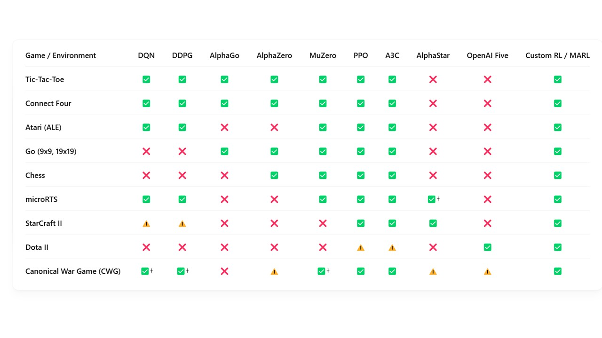

# Our Project

Our team has embarked on a research project to develop an AI-driven canonical war game and warfighting agent to evaluate conflict scenarios, enhance planning, shape military training, and inform decision-making. The project is in three phases.

## Phase 1: Game and Algorithm Review

We begin by evaluating the state-of-the-art algorithms against a spectrum of strategy games—from simple board games to complex real-time strategy (RTS) games (e.g., StarCraft II). This comparative framework will help us understand which algorithms generalize best across environments.

Key games to include (from simplest to complex):

- Perfect information games: Tic-Tac-Toe, Chess, Go
- Atari games: Simple environments with visual input data
- Partial information games: Poker, Stratego
- Simple RTS: microRTS, simplified Starcraft
- Complex RTS: Starcraft II, DOTA 2
- Modern military simulations: Commercial and USG funded (e.g., DARPA's Strategic Capability Office simulations)

Key algorithms to include:

- Evolutionary / Genetic
- Deep Reinforcement Learning: AlphaZero, MuZero, DQN, DDPG, PPO, A3C, etc.
- Multi-agent approaches: QMIX, MADDPG
- Imitation learning and Inverse RL
- Hybrid approaches

```{note} 
Information below is only representative and heuristic. Selective verification of the table is a goal of the project.
```



<p style="text-align: center;"><em>Figure 1. Games & Algorithms Matrix</em></p>


## Phase 2: Canonical War Game Development

For Phase 2, we will develop a comprehensive RTS-style war game that incorporates realistic conflict scenarios across all operational domains. and simulation platforms, This canonical war game (CWG) will simulate unified global combat, incorporating land, air, sea, space, and cyberspace domains. P hase 2 will also assimilate lessons from real-world doctrine and military strategy. 

1. Environment design:
   - Multi-domain representation (land, air, sea, space, cyber)
   - Realistic physics and constraint modeling
   - Asymmetric information structures
2. State representation:
   - Hierarchical command structures
   - Resource constraints (logistics, supply chains)
   - Intelligence gathering mechanisms
3. Action space design:
   - Tactical vs. strategic decisions
   - Time scales (immediate actions vs. long-term planning)
   - Command and control limitations

This CWG will focus on tactical and strategic realism, embedding proper mechanics, accurate physics, and simulate the logistics of war along with rules and doctrine.  The initial game will be "headless" (minimal graphics) to test verify the game logic, prediction, and control. Once validated, graphics can be added to convert the game  into a purpose-built  simulation platform. 

## Phase 3: Canonical  Aigent Training

Using DRL and other advanced AI methods, we will train an agent to adapt, learn, and prevail against the CWG over thousands of simulated multi-domain conflict scenarios. The goal is to create an AI capable of assisting in mission planning, in-theater decision-making, and post-conflict analysis. 

1. Training methodology:
   - Self-play for symmetric scenarios
   - Red team/Blue team approaches for asymmetric scenarios
   - Curriculum learning from simple to complex scenarios
2. Decision architectures:
   - Hierarchical / multi-level decision making
   - Observation priorities (attention) in large state spaces
   - Long / short term memory over extended time spans
3. Evaluation framework:
   - Performance against human experts
   - Robustness to unexpected scenarios ("fog of war")
   - Human interpretability of agent decisions

Phase 3 aims to deliver a high-performing AI agent that supports warfighters with predictive insights and scenario analysis. The end goal is to develop a superhuman agent that enhances human decision-making before, during, and after conflict, delivering a decisive advantage in global 21st-century warfare.
